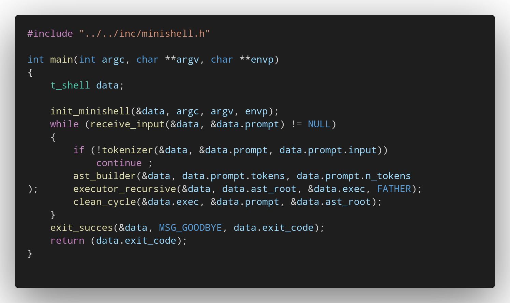

# 🐚 Minishell - Advanced Unix Shell Implementation

Minishell is a robust POSIX-compatible command interpreter implementation, developed entirely in C as part of 42 School's advanced curriculum.

This project represents a significant milestone for me [@LordMikkel](https://github.com/LordMikkel) and my partner [@David-dbd](https://github.com/David-dbd): it is our first large-scale collaborative development (10,000+ lines of personal code), designed to delve deep into Unix system architecture, process management, and compiler theory. Unlike basic academic implementations, this shell has been engineered with a focus on user experience (UX), memory stability and optimization, and a scalable AST-based architecture.

<p align="center">  </p>

## 📥 0. Installation & Usage

```bash
git clone https://github.com/LordMikkel/Minishell.git
cd minishell
make
./minishell
```

## 📑 Index
1. [🔧 System Overview & Dependencies](#🔧-1-system-overview--dependencies)
2. [🏗️ Architecture & Parsing Logic](#️🏗️-2-architecture--parsing-logic)
3. [⚙️ Core Components: The AST & Execution](#️⚙️-3-core-components-the-ast--execution)
4. [⚡ Features & Capabilities](#⚡-4-features--capabilities)
5. [🧠 Technical Complexity](#🧠-5-technical-complexity)
6. [♻️ Memory Management Strategy](#️♻️-6-memory-management-strategy)
7. [🧪 Testing & Quality Control](#🧪-7-testing--quality-control)
8. [✍️ Credits](#️✍️-8-credits)

## 🔧 1. System Overview & Dependencies

The core has been built to operate with efficiency comparable to lightweight production shells, minimizing external dependencies and maximizing control over system resources.

### Dependencies & Libraries

*   **Libft (Custom Standard Library):** We use our own library (a prerequisite from previous curriculum) that reimplements essential C functions. Not just string handling, but custom implementations of printf, file I/O, and memory management, forming the foundation upon which the shell operates.
*   **Isocline (Modified Fork):** We chose isocline as the command-line engine but performed a strategic fork to adapt it to the needs of a real shell.
    *   **Leak Correction:** We detected and patched an existing memory leak in the original library to ensure impeccable memory usage.
    *   **Signal Compatibility:** We modified the internal behavior so that operating system signal reception interacts correctly with our shell's lifecycle, emulating the native behavior of readline.

## 🏗️ 2. Architecture & Parsing Logic

The data flow follows a strict modular design inspired by modern compiler theory.

### 2.1. The Tokenizer (Lexical Analysis)

User input is processed and converted into a dynamic array of tokens (reallocated as needed). Unlike a simple split, our lexer types each element for the parser:

**Token Types:** WORD, COMMAND, OR (`||`), AND (`&&`), SEMICOLON (`;`), REDIR_INPUT (`<`), REDIR_OUTPUT (`>`), REDIR_APPEND (`>>`), REDIR_HEREDOC (`<<`), ASIGNATION (`VAR=val`), EXPANSION (`$VAR`), SUBSHELL.

### 2.2. Expansion Strategy

We implemented a hybrid expansion strategy:
*   **Safe Expansion:** Expansions that don't alter the command structure are resolved early.
*   **Late Binding:** For variables that could mutate or affect execution, we wait until just before execution to expand them, ensuring data integrity.

### 2.3. Parser & Backtracking (Syntactic Analysis)

We employ a **Recursive Descent Parser** algorithm supported by **Backtracking**.

**Logic:** The parser attempts to build a branch of the linked node tree based on grammatical rules. If it encounters a syntactic inconsistency, the algorithm "backtracks" to try an alternative rule, similar to how programming language compilers operate.

### 2.4. Grammar & Precedence Hierarchy
To handle complex command combinations properly, our Recursive Descent Parser follows a strict priority hierarchy (from lowest to highest binding power). This ensures that operators are grouped correctly without ambiguity:

1.  **Sequence Level (`;`):** The lowest priority. Splits independent commands.
2.  **Logical Level (`&&`, `||`):** Handles conditional execution based on the previous exit code.
3.  **Pipeline Level (`|`):** Connects the output of one process to the input of the next.
4.  **Subshell Level (`( )`):** Detected parentheses trigger a recursive call to the sequence parser within a forked process.
5.  **Command Level:** Grouping of words, variables, and redirections into an actionable command.

This hierarchical approach allows constructs like `(ls | wc) && echo "done"; sleep 5` to be parsed naturally into a coherent tree.

## ⚙️ 3. Core Components: The AST & Execution



### 3.1. Abstract Syntax Tree (AST) Builder

The data structure is not linear; it's a binary tree representing the logical hierarchy of the command.

*   **Intermediate Nodes:** Represent flow control (AND, OR, SEMICOLON, PIPE) and redirections (`> file` is treated as a node modifying output).
*   **Subshells:** Parentheses generate subshell nodes that encapsulate a complete sub-tree.
*   **Leaves:** The final commands (COMMAND) reside at the tree's leaves.

this video -> [What Is An Abstract Syntax Tree?](https://www.youtube.com/watch?v=wINY109MG10) can help you to undestand the key concept.

### 3.2. Recursive Executor

The execution engine traverses the AST using a **Depth-First Search (DFS)** strategy:

*   **Sequences:** The semicolon (`;`) is treated as a separator allowing independent sequences within the same logical line.
*   **Conditional Logic:** Evaluates AND/OR nodes based on the exit status of the previous branch.
*   **Isolation:** Upon encountering a SUBSHELL node, the process forks to protect the parent environment.

### 3.3. State Management (`t_shell`)

The entire shell state is managed through a main `t_shell` data structure passed by reference. This structure contains all allocated information necessary for the shell to operate, both on the stack and the heap.

*   **Signal Handling:** Adhering strictly to POSIX and project norms, we use a single global variable exclusively for the reception and transmission of operating system signals.

### 3.4 Flow Diagram

```
.──────────────────────────────────────────────────────────────────────────────.
|                   🐚  MINISHELL SYSTEM ARCHITECTURE                          |
|                 "Recursive Abstract Syntax Tree Engine"                      |
`──────────────────────────────────────────────────────────────────────────────`
                                       │
                                       ▼
╔══════════════════════════════════════════════════════════════════════════════╗
║  1. SYSTEM BOOTSTRAP (Initialization Phase)                                  ║
║  [Concept: State Persistence & Environment Loading]                          ║
║                                                                              ║
║  • Global Setup: Init and allocate main shell structures (heap).             ║
║  • Signal Config: Configures SIGINT/SIGQUIT (Parent Mode).                   ║
║  • Environment Vectorization: Transforms char** envp to Linked List.         ║
╚══════════════════════════════════════╦═══════════════════════════════════════╝
                                       │
      .────────────────────────────────▼────────────────────────────────.
┌────>|                  🔄 THE INFINITE RUNTIME LOOP                   |
│     |             (Input Cycle -> Evaluation -> Feedback)             │
│     `────────────────────────────────┬────────────────────────────────´
│                                      │
│  ┌───────────────────────────────────▼───────────────────────────────────┐
│  │  2. INPUT INTERFACE (Blocking I/O)                                    │
│  │  [Concept: Interactive Readline Wrapper]                              │
│  │                                                                       │
│  │  • Displays prompt (User@Host) and blocks waiting for STDIN.          │
│  │  • Captures raw string buffer (char *input).                          │
│  │  • Intercepts Signals (Ctrl+C) to redraw prompt if needed.            │
│  └───────────────────────────────────┬───────────────────────────────────┘
│                                      │ Raw Input Stream
│                                      ▼
│  ┌───────────────────────────────────────────────────────────────────────┐
│  │  3. LEXICAL ANALYSIS (Tokenizer)                                      │
│  │  [Concept: Linear Atomization]                                        │
│  │                                                                       │
│  │  • Scans raw string char-by-char.                                     │
│  │  • Generates a linear ARRAY of classified Tokens.                     │
│  │  • Types: WORD, PIPE, REDIR_IN, REDIR_OUT, etc.                       │
│  │  • Syntax review check: Check correct rules and input from the user.  │
│  └───────────────────────────────────┬───────────────────────────────────┘
│                                      │ t_token *list
│                                      ▼
│  ┌───────────────────────────────────────────────────────────────────────┐
│  │  4. SYNTACTIC ANALYSIS (AST Builder)                                  │
│  │  [Concept: Tree Construction & Node Conversion]                       │
│  │                                                                       │
│  │  • Consumes the Token List using Grammar Rules (Precedence).          │
│  │  • Converts Tokens into specific Tree Nodes (t_node).                 │
│  │  • Structures the hierarchy: Pipe -> Command -> Properties -> Args    │
│  └───────────────────────────────────┬───────────────────────────────────┘
│                                      │ t_node *ast_root
│                                      ▼
│  ┌───────────────────────────────────────────────────────────────────────┐
│  │  5. RECURSIVE EXECUTION KERNEL (The Core)                             │
│  │  [Concept: Depth-First Traversal & Process Orchestration]             │
│  │                                                                       │
│  │  Traverses the AST branches. Logic depends on Node Type:              │
│  │                                                                       │
│  │  [A] SEQUENCE NODE ( ; )                                              │
│  │      ↳ Unconditional Separation. Executes Left, if exist then Right.  │
│  │                                                                       │
│  │  [B] LOGICAL NODES ( &&, || )                                         │
│  │      ↳ Conditional. Checks Left's exit code before executing Right.   │
│  │                                                                       │
│  │  [C] PIPELINE NODE ( | )                                              │
│  │      ↳ Manages IPC. Forks Writer (Left) and Reader (Right).           │
│  │                                                                       │
│  │  [D] ISOLATION NODE ( Subshells ( ) )                                 │
│  │      ↳ Forks a generic child to protect Parent Env from mutations.    │
│  │                                                                       │
│  │  [E] LEAF NODE ( Commands / Redirs )                                  │
│  │      ↳ Applies Redirections (dup2) -> Expands $VAR -> Execs.          │
│  └───────────────────────────────────┬───────────────────────────────────┘
│                                      │ Exit Status
│                                      ▼
│  ┌───────────────────────────────────────────────────────────────────────┐
│  │  6. CYCLE SANITIZATION (Transient Memory Reset)                       │
│  │  [Concept: Garbage Collection]                                        │
│  │                                                                       │
│  │  • Recursively frees the AST Nodes (commands, args, structure).       │
│  │  • Frees the token array and Raw Input string.                        │
│  │  • Closes transient FDs (pipes/files) but keeps History/Env alive.    │
│  └───────────────────────────────────┬───────────────────────────────────┘
│                                      │
│           (Loop continues)           │
└──────────────────────────────────────┤
                                       │
                                       ▼
                              [ Signal: EOF / Exit ]
                                       │
                                       ▼
   .______________________________________________________________________.
   |                                                                      |
   |   🛑 SYSTEM SHUTDOWN SEQUENCE                                        |
   |   ────────────────────────────────────────────────────────────────   |
   |                                                                      |
   |   1. USER NOTIFICATION  → Prints "exit" / goodbye message.           |
   |   2. HEAP TEARDOWN      → Frees global environment & main struct.    |
   |   3. KERNEL RETURN      → Exits process with final status code.      |
   |                                                                      |
   |   [ SYSTEM HALTED ]                                                  |
   |______________________________________________________________________|
```

## ⚡ 4. Features & Capabilities

### Core Features
*   Complete Operators: Pipes (`|`), Redirections, Append, Heredoc.
*   Control Logic: `&&`, `||` and `;`.
*   Process Management: Execution of binaries, scripts, and builtins.

### Bonus Features
We went beyond academic requirements to create a pleasant-to-use tool:

*   **Line Continuation & Balanced Input:** The shell intelligently detects incomplete commands (unclosed quotes, pipes, parentheses) and provides a secondary `>` prompt, allowing users to complete multi-line statements naturally. This mimics the behavior of advanced shells like `bash` and `zsh`.
*   **Local Assignments:** Support for `VAR=value` command (the variable exists only for that command) and temporary assignments in the current shell.
*   **Persistent History:** The shell creates and manages a physical history file, allowing command retrieval from previous sessions.
*   **Smart Welcome:** On startup, the shell detects the user from the environment, greets according to the time of day, and configures the environment.
*   **Session Analytics:** Upon exit (`exit`), it informs the user of the total time spent in the session with a farewell message.
*   **Custom Prompt:** A modern, highly aesthetic prompt that displays:
    *   Current directory (PWD).
    *   User and Hostname.
    *   Harmonized color theme and visual feedback of the last command's status.

## 🧠 5. Technical Complexity

*   **Parsing and Execution Algorithms:** Implementing a parser with backtracking from scratch in C requires extremely meticulous manual handling of the stack and memory to avoid stack overflows or leaks.
*   **Memory Management:** Since C has no Garbage Collector, every token, AST node, and environment variable is managed manually. Cleaning the AST also requires using recursive functions to clear these structures in a controlled manner.
*   **Concurrency & Signals:** Synchronization between the parent process (shell) and children (commands), ensuring signals like Ctrl+C only affect the correct processes (blocking vs non-blocking), was one of the biggest synchronization challenges in the project.

## ♻️ 6. Memory Management Strategy

Since `minishell` is a long-running process, memory leaks are unacceptable. We implemented a two-tier cleaning strategy:

### The `clean_cycle()`
Executed after every command line input (inside the main loop).
* **Restores FDs:** Resets STDIN/STDOUT if redirections altered them.
* **Prunes AST:** Recursively frees the entire Syntax Tree nodes.
* **Wipes Token List:** Frees the dynamic array of tokens for the next prompt.

### The `clean_all()` (Shutdown)
Executed only upon `exit` or fatal error.
* **Free All:** Frees environment variables linked lists, history descriptors, ast nodes, token array and internal shell configurations.
* **Result:** 0 leaks reachable at exit (validated with Valgrind).

### 🧪 7. Testing & Quality Control

To ensure system robustness we tested our Minishell to intensive automated testing using the community-standard [42_minishell_tester](https://github.com/zstenger93/42_minishell_tester). Our customized testing regimen covered everything from basic command execution to edge cases like signal handling, complex pipe chains, and memory leak detection via Valgrind.

###  Test Results Summary
The implementation successfully passed all validation criteria:
* **Mandatory Tests:** ✅ +2566 mandatory tests
* **Bonus Tests:** ✅ +201 bonus tests.

## ✍️ Credits

I'm Mikel Garrido [@LordMikkel](https://github.com/LordMikkel), a student at 42 Barcelona. I always try to make the simplest but most robust implementation in all my projects.

This project was developed in collaboration with my partner [@David-dbd](https://github.com/David-dbd). For additional insights and project details, you can also view his personal README in the forked repository: [Minishell](https://github.com/David-dbd/Minishell-SHELL).

[](https://profile.intra.42.fr/users/migarrid)

